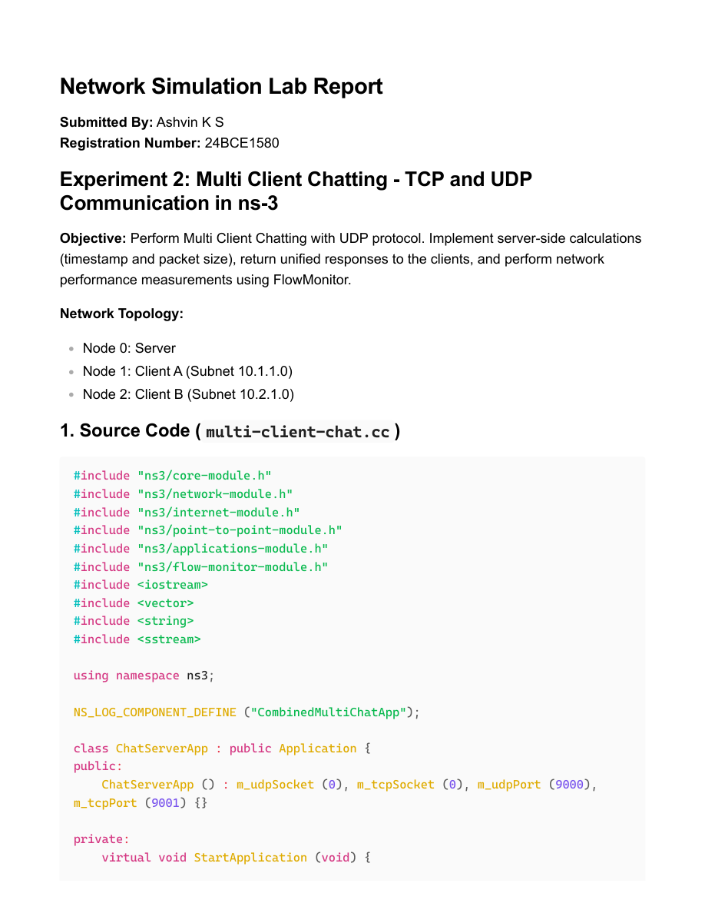
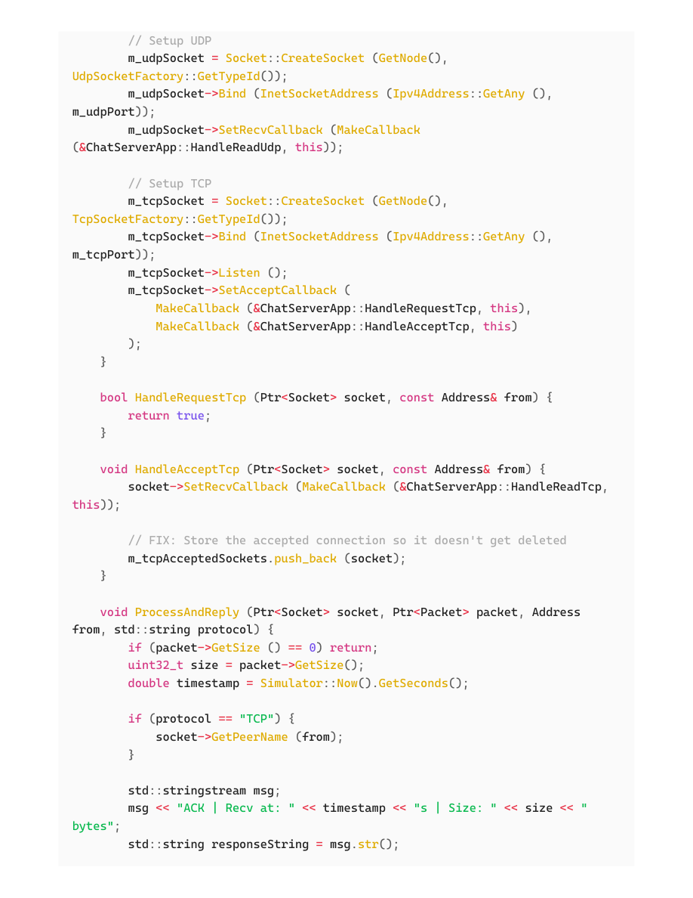

# EXP10 - Multi Client Chatting (ns-3)

- Source PDF: 24bce1580_EXP10_CN.pdf
- Pages: 6

## Snapshot

Network Simulation Lab Report
Submitted By: Ashvin K S
Registration Number: 24BCE1580
Experiment 2: Multi Client Chatting - TCP and UDP
Communication in ns-3
Objective: Perform Multi Client Chatting with UDP protocol. Implement server-side calculations
(timestamp and packet size), return unified responses to the clients, and perform network
performance measurements using FlowMonitor.
Network Topology:
1. Source Code ( multi-client-chat.cc)
Node 0: Server
Node 1: Client A (Subnet 10.1.1.0)

## Screenshots

## Code / Steps

The full extracted text is stored in [source.txt](source.txt).
