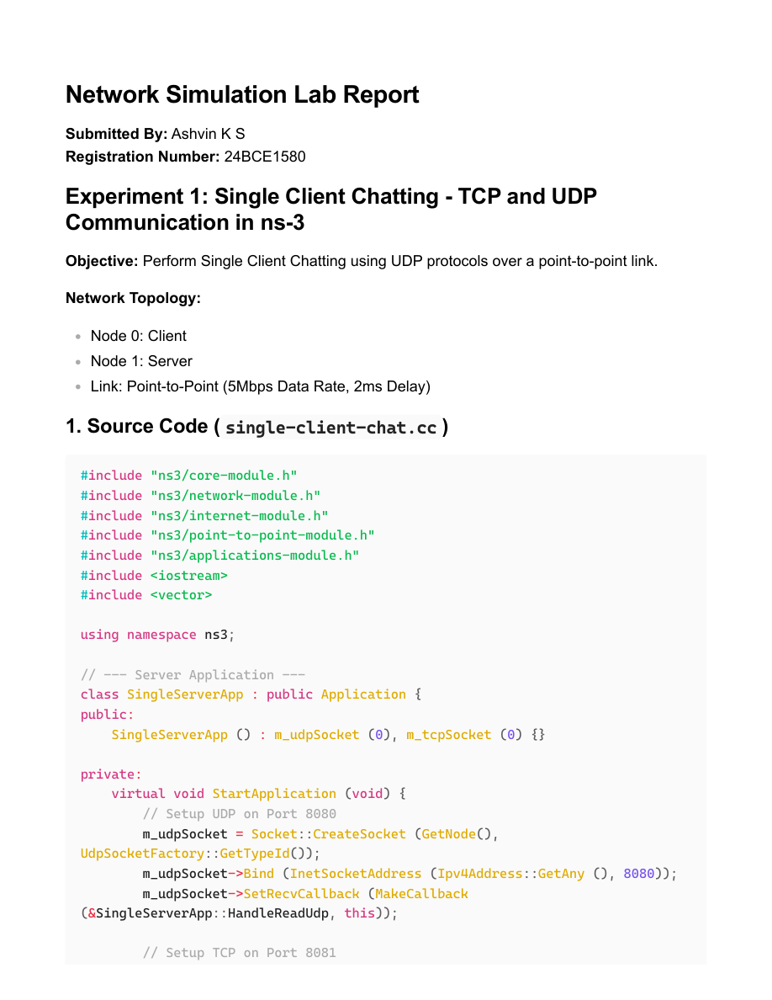
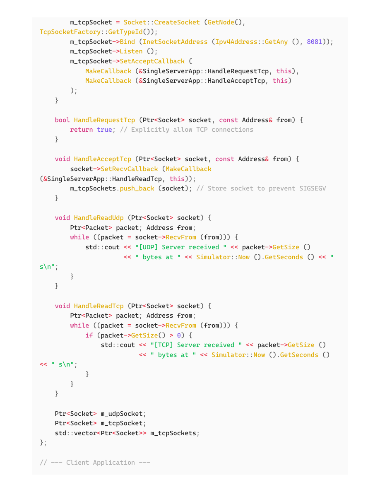

# EXP4 - Single Client Chatting (ns-3)

- Source PDF: 24bce1580_EXP4_CN.pdf
- Pages: 5

## Snapshot

Network Simulation Lab Report
Submitted By: Ashvin K S
Registration Number: 24BCE1580
Experiment 1: Single Client Chatting - TCP and UDP
Communication in ns-3
Objective: Perform Single Client Chatting using UDP protocols over a point-to-point link.
Network Topology:
1. Source Code ( single-client-chat.cc)
Node 0: Client
Node 1: Server
Link: Point-to-Point (5Mbps Data Rate, 2ms Delay)
#include"ns3/core-module.h"

## Screenshots

## Code / Steps

The full extracted text is stored in [source.txt](source.txt).
