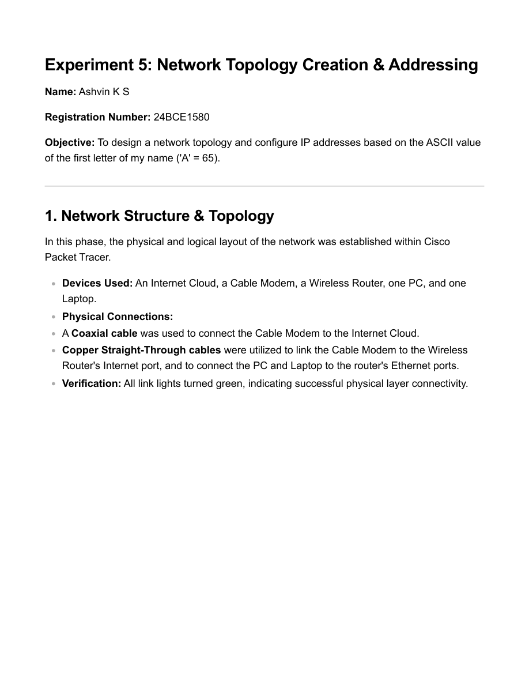
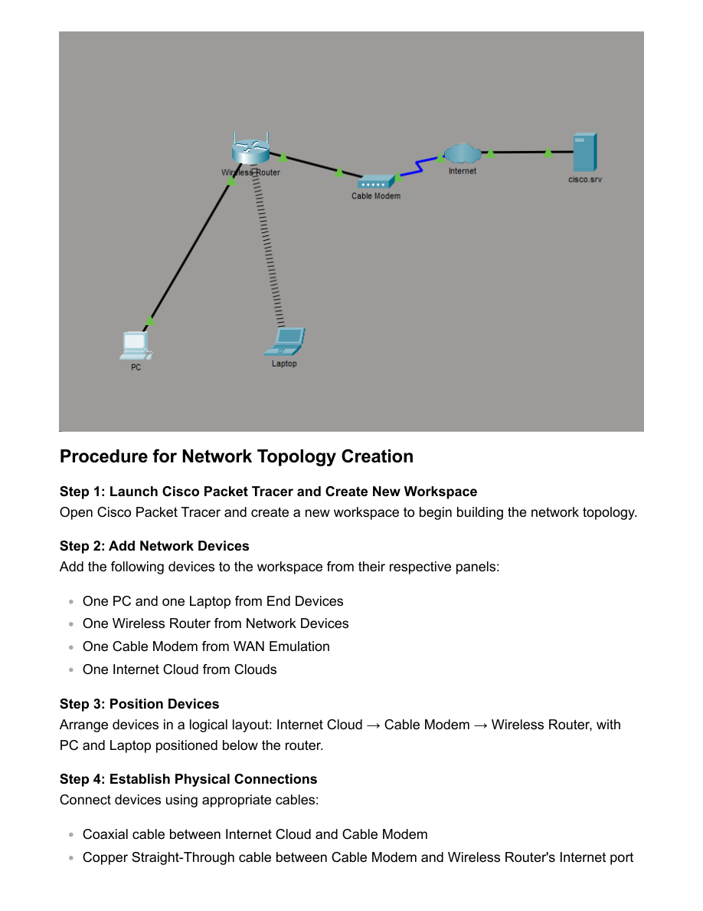

# Experiment 5: Network Topology Creation & Addressing

- Source PDF: 24bce1580_EXP5_CN.pdf
- Pages: 7

## Snapshot

Experiment 5: Network Topology Creation & Addressing
Name: Ashvin K S
Registration Number: 24BCE1580
Objective: To design a network topology and configure IP addresses based on the ASCII value
of the first letter of my name ('A' = 65).
1. Network Structure & Topology
In this phase, the physical and logical layout of the network was established within Cisco
Packet Tracer.
Devices Used: An Internet Cloud, a Cable Modem, a Wireless Router, one PC, and one
Laptop.
Physical Connections:
A Coaxial cable was used to connect the Cable Modem to the Internet Cloud.

## Screenshots

## Code / Steps

The full extracted text is stored in [source.txt](source.txt).
