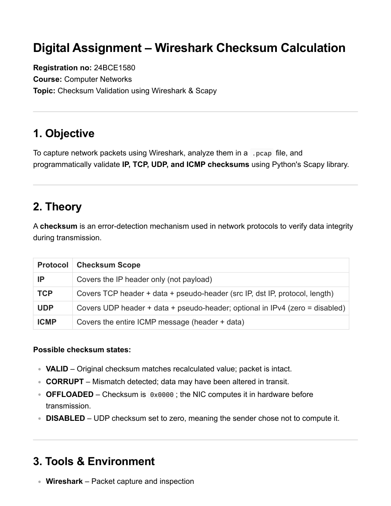
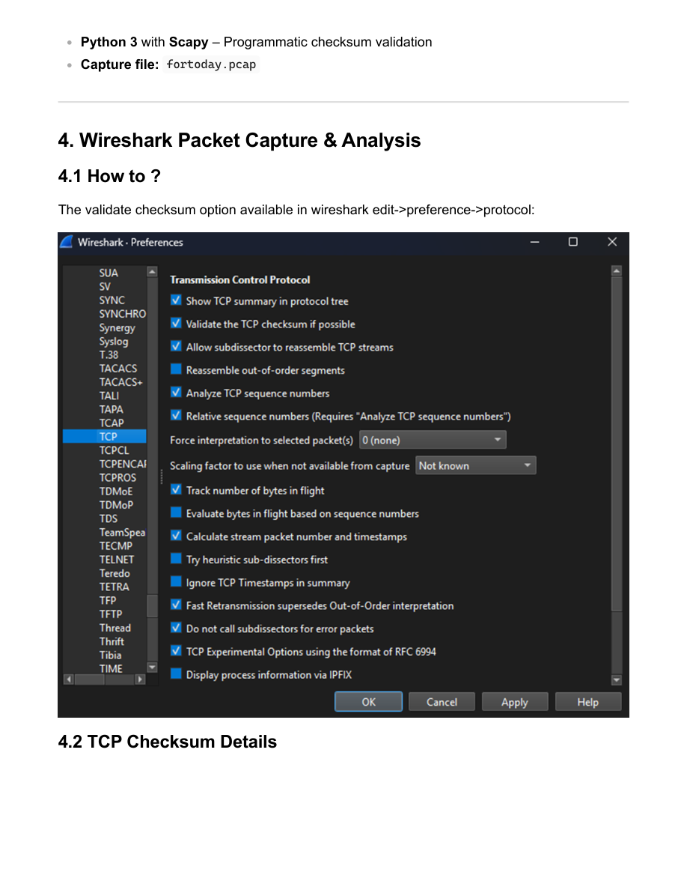

# EXP6 - Wireshark Checksum Calculation

- Source PDF: 24bce1580_EXP6_CN.pdf
- Pages: 13

## Snapshot

Digital Assignment – Wireshark Checksum Calculation
Registration no: 24BCE1580
Course: Computer Networks
Topic: Checksum Validation using Wireshark & Scapy
1. Objective
To capture network packets using Wireshark, analyze them in a .pcap file, and
programmatically validate IP, TCP, UDP, and ICMP checksums using Python's Scapy library.
2. Theory
A checksum is an error-detection mechanism used in network protocols to verify data integrity
during transmission.
ProtocolChecksum Scope
IP Covers the IP header only (not payload)

## Screenshots

## Code / Steps

The full extracted text is stored in [source.txt](source.txt).
