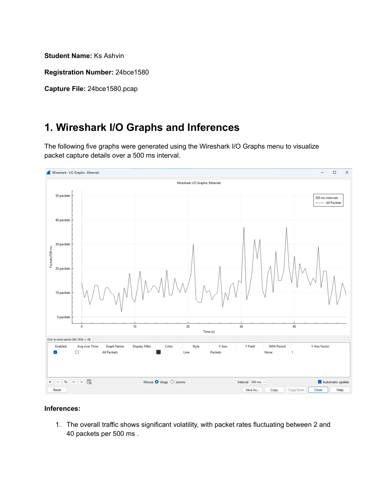
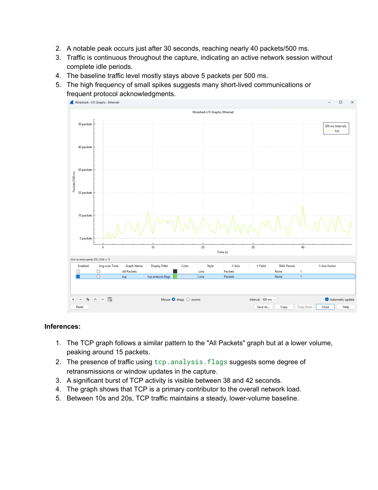

# EXP7 - Wireshark I/O Graph Analysis

- Source PDF: 24bce1580_EXP7_CN.pdf
- Pages: 12

## Snapshot

Student  Name:  Ks  Ashvin
Registration  Number:  24bce1580
Capture  File:  24bce1580.pcap
1.  Wireshark  I/O  Graphs  and  Inferences
The  following  five  graphs  were  generated  using  the  Wireshark  I/O  Graphs  menu  to  visualize
packet
capture
details
over
a
500
ms

## Screenshots

## Code / Steps

The full extracted text is stored in [source.txt](source.txt).
