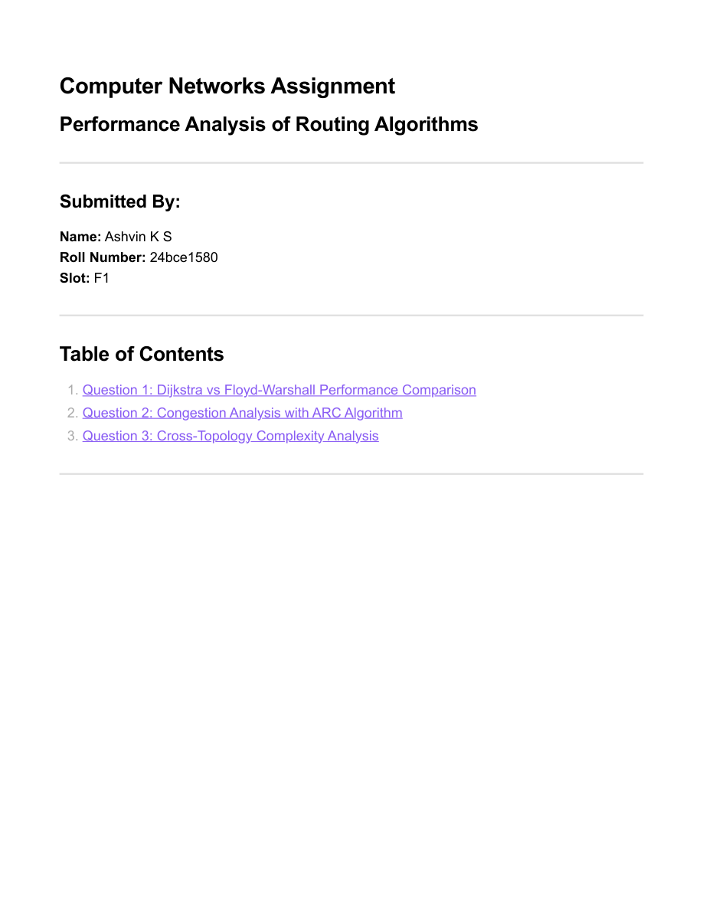
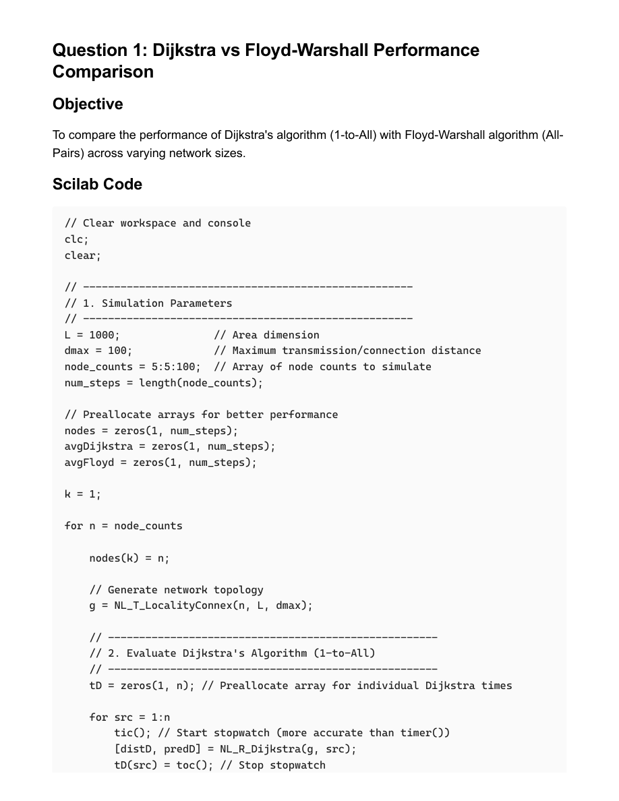

# Scilab Routing and Congestion Control Assignment

- Source PDF: 24bce1580_EXP_Scilab_Routing and Congestion Control_CN.pdf
- Pages: 18

## Snapshot

Computer Networks Assignment
Performance Analysis of Routing Algorithms
Submitted By:
Name: Ashvin K S
Roll Number: 24bce1580
Slot: F1
Table of Contents
1. Question 1: Dijkstra vs Floyd-Warshall Performance Comparison
2. Question 2: Congestion Analysis with ARC Algorithm
3. Question 3: Cross-Topology Complexity Analysis

## Screenshots

## Code / Steps

The full extracted text is stored in [source.txt](source.txt).
