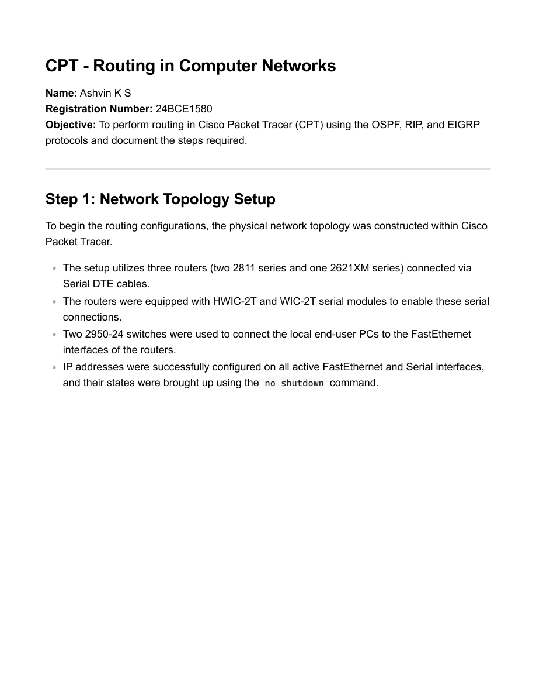
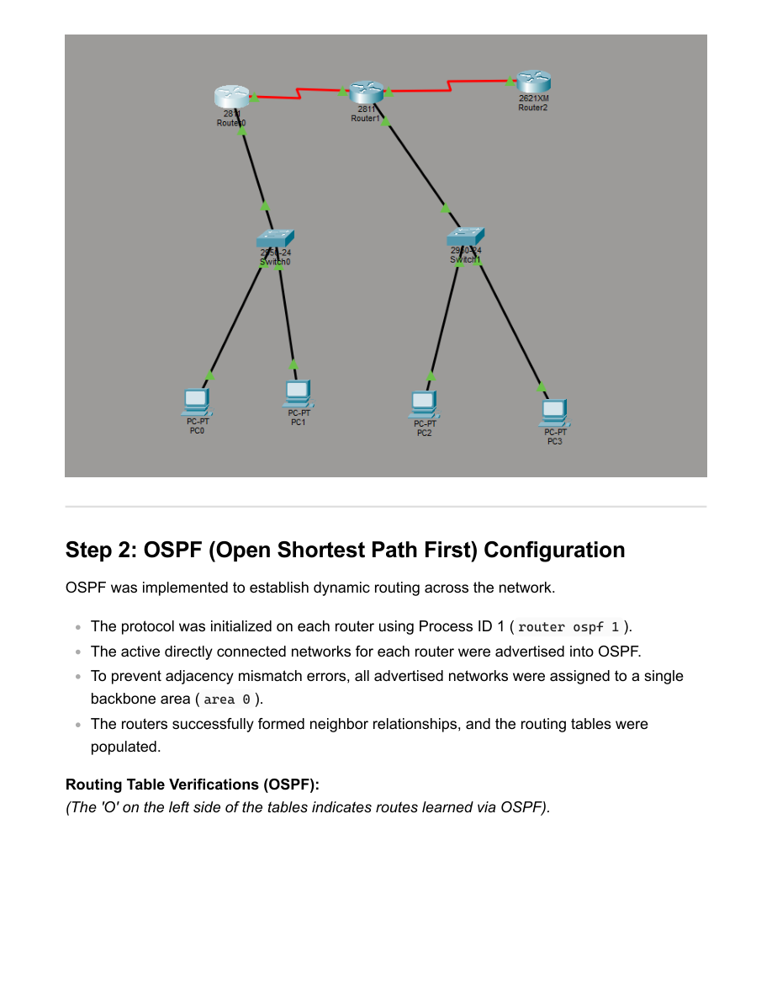

# EXP11/12 - Routing in Packet Tracer (Report)

- Source PDF: 24bce1580_CPT_CN.pdf
- Pages: 7

## Snapshot

CPT - Routing in Computer Networks
Name: Ashvin K S
Registration Number: 24BCE1580
Objective: To perform routing in Cisco Packet Tracer (CPT) using the OSPF, RIP, and EIGRP
protocols and document the steps required.
Step 1: Network Topology Setup
To begin the routing configurations, the physical network topology was constructed within Cisco
Packet Tracer.
The setup utilizes three routers (two 2811 series and one 2621XM series) connected via
Serial DTE cables.
The routers were equipped with HWIC-2T and WIC-2T serial modules to enable these serial
connections.

## Screenshots

## Code / Steps

The full extracted text is stored in [source.txt](source.txt).
