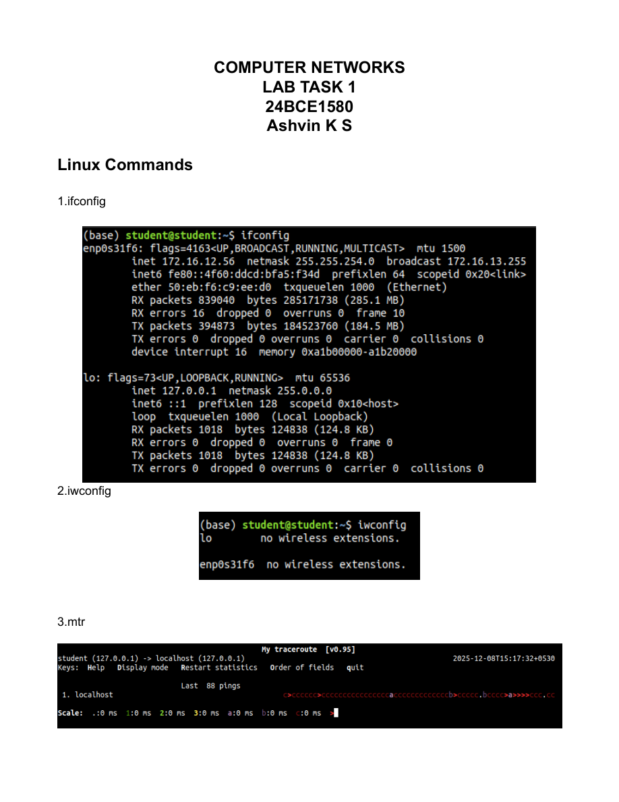
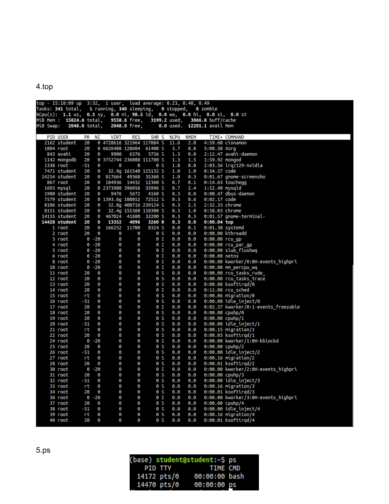

# LAB1 - Linux Commands Report

- Source PDF: CN_24BCE1580_LAB1.pdf
- Pages: 21

## Snapshot

COMPUTER  NETWORKS  LAB  TASK  1  24BCE1580  Ashvin  K  S   Linux  Commands   1.ifconfig
2.iwconfig          3.mtr

## Screenshots

## Code / Steps

The full extracted text is stored in [source.txt](source.txt).
