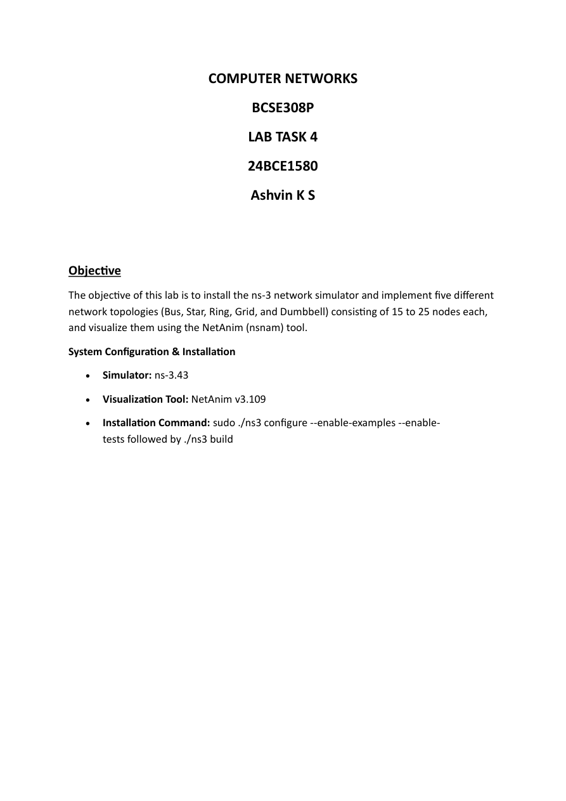
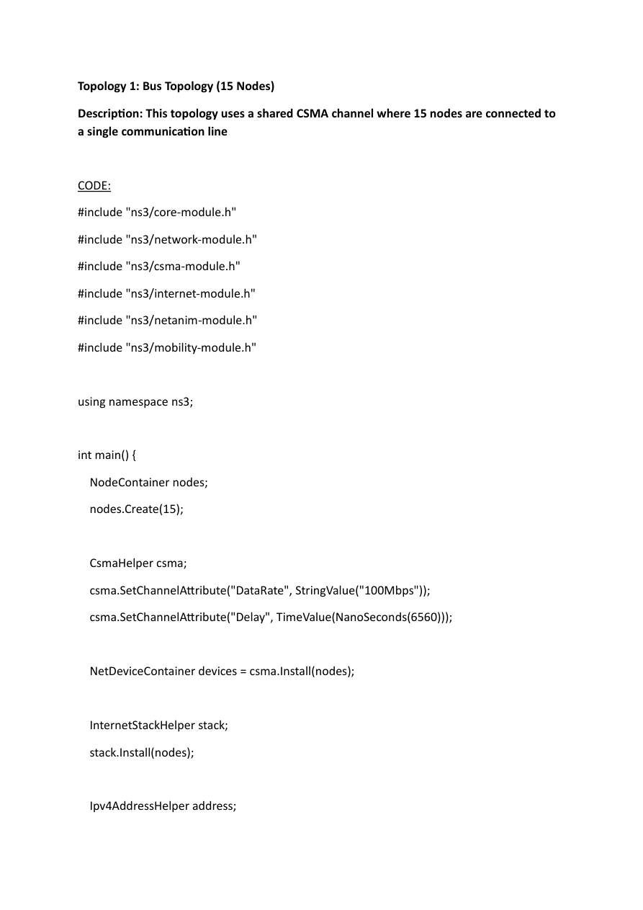

# LAB4 - ns-3 Topologies Report

- Source PDF: CN_24BCE1580_LAB4.pdf
- Pages: 14

## Snapshot

COMPUTER NETWORKS
BCSE308P
LAB TASK 4
24BCE1580
Ashvin K S
Objective
The objective of this lab is to install the ns-3 network simulator and implement five different
network topologies (Bus, Star, Ring, Grid, and Dumbbell) consisting of 15 to 25 nodes each,
and visualize them using the NetAnim (nsnam) tool.
System Configuration & Installation
• Simulator: ns-3.43
• Visualization Tool: NetAnim v3.109

## Screenshots

## Code / Steps

The full extracted text is stored in [source.txt](source.txt).
