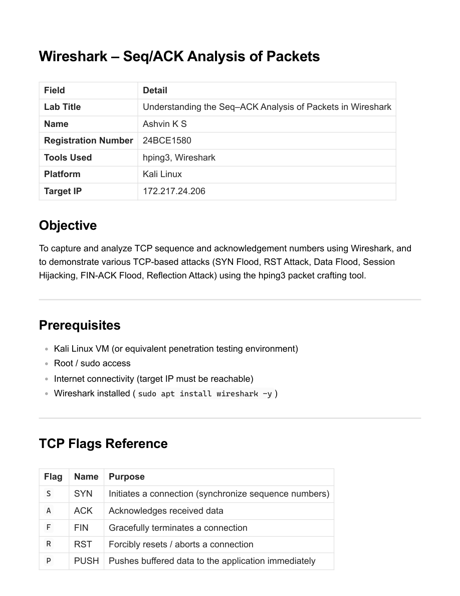
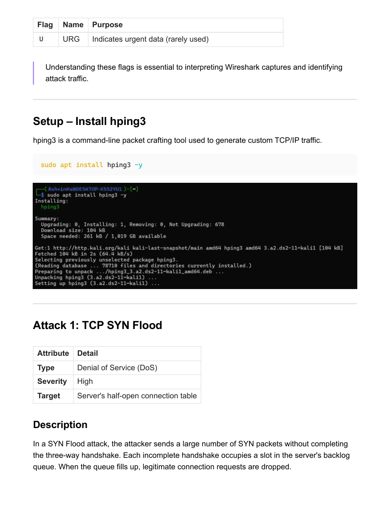

# Seq/ACK Analysis Report (Wireshark)

- Source PDF: Wireshark_Seq_ACK_Analysis_24bce1580.pdf
- Pages: 11

## Snapshot

Wireshark – Seq/ACK Analysis of Packets
Field Detail
Lab Title Understanding the Seq–ACK Analysis of Packets in Wireshark
Name Ashvin K S
Registration Number24BCE1580
Tools Used hping3, Wireshark
Platform Kali Linux
Target IP 172.217.24.206
Objective
To capture and analyze TCP sequence and acknowledgement numbers using Wireshark, and
to demonstrate various TCP-based attacks (SYN Flood, RST Attack, Data Flood, Session
Hijacking, FIN-ACK Flood, Reflection Attack) using the hping3 packet crafting tool.

## Screenshots

## Code / Steps

The full extracted text is stored in [source.txt](source.txt).
